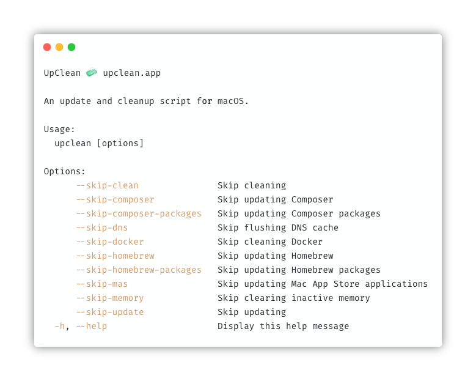

# UpClean

An update and cleanup script for macOS.

- [Installation](#installation)
- [Usage](#usage)
- [Configuration](#configuration)
- [Update](#update)
- [Uninstall](#uninstall)



## Installation

You can use any of the methods below to install UpClean:

```bash
sh -c "$(curl -fsSL https://raw.githubusercontent.com/divspace/upclean/master/installer.sh)"
```

```bash
sh -c "$(wget https://raw.githubusercontent.com/divspace/upclean/master/installer.sh -O -)"
```

```bash
curl -o upclean https://raw.githubusercontent.com/divspace/upclean/master/upclean.sh
chmod +x upclean
mv upclean /usr/local/bin/upclean
```

## Usage

```
$ upclean --help

UpClean 1.5.0 🧼 upclean.app

An update and cleanup script for macOS.

Usage:
  upclean [options]

Options:
      --skip-clean               Skip cleaning
      --skip-composer            Skip updating Composer
      --skip-composer-packages   Skip updating Composer packages
      --skip-dns                 Skip flushing DNS cache
      --skip-docker              Skip cleaning Docker
      --skip-homebrew            Skip updating Homebrew
      --skip-homebrew-packages   Skip updating Homebrew packages
      --skip-mas                 Skip updating Mac App Store applications
      --skip-memory              Skip clearing inactive memory
      --skip-update              Skip updating
  -h, --help                     Display this help message
```

## Configuration

You can configure the [runtime options](#usage) by adding them to the `.upcleanrc` file in your home directory:

```bash
# File: ~/.upcleanrc
--skip-dns
--skip-memory
```

Passing options directly will override any configuration options that you may have set.

## Update

```bash
curl -fsSL "https://raw.githubusercontent.com/divspace/upclean/master/installer.sh" | bash -s update
```

## Uninstall

```bash
curl -fsSL "https://raw.githubusercontent.com/divspace/upclean/master/installer.sh" | bash -s uninstall
```
